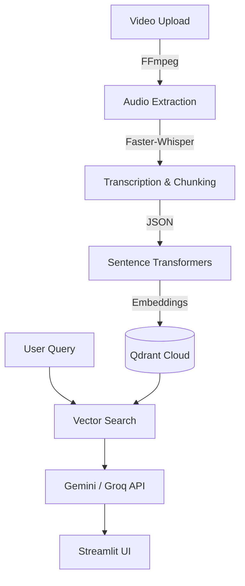

# System Architecture

MindMesh AI is built as a highly modular, enterprise-grade Retrieval-Augmented Generation (RAG) platform specifically tuned for video content.

## High-Level Data Flow

## Component Breakdown

### 1. Video Processing (`FFmpeg`)
When a user uploads a video file (`.mp4`, `.mkv`), it is saved locally. FFmpeg extracts the audio stream into a clean, normalized `.wav` file to prepare it for transcription, discarding massive video data to save compute.

### 2. Transcription (`Faster-Whisper`)
The extracted audio is passed to `faster-whisper`. This local model runs highly optimized int8 inference (on CPU or GPU) to generate accurate timestamps and text. The output is structured into overlapping, logical JSON chunks.

### 3. Embeddings (`Sentence Transformers`)
The text chunks are passed through the `BAAI/bge-small-en-v1.5` embedding model. This generates high-quality 384-dimensional dense vectors representing the semantic meaning of each chunk.

### 4. Vector Database (`Qdrant Cloud`)
The 384-dim vectors, along with rich payload metadata (timestamps, video ID, text), are upserted into Qdrant Cloud. Qdrant provides ultra-fast Approximate Nearest Neighbor (ANN) search using cosine distance.

### 5. LLM Gateway (`Gemini / Groq`)
When a user asks a question via the AI Chat, the query is vectorized and searched against Qdrant. The top matching chunks are injected into a strict system prompt. The prompt is then routed to the active LLM Provider (Google Gemini or Groq) to generate a conversational, accurate answer based entirely on the provided context.

### 6. Frontend (`Streamlit`)
The entire application is wrapped in a beautiful, responsive Streamlit interface, offering an Upload Center, Settings, System Dashboard, and the AI Chat itself.
