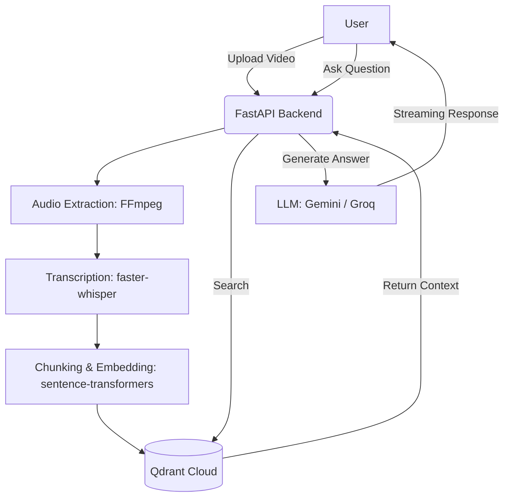

  

# MindMesh-AI

A full-stack RAG (Retrieval-Augmented Generation) AI application that processes videos and audio files, transcribes them, generates embeddings, and lets you chat with your content using Gemini and Groq models.

## Features

- **Upload & Process:** Upload video/audio files (MP4/MP3) for automatic transcription using `faster-whisper`.
- **Vector Search:** Automatically chunks and vectorizes text using `sentence-transformers` and stores it in Qdrant Cloud.
- **RAG Chat:** Ask questions and get answers with citations referencing exactly which video the answer came from.
- **Multi-LLM Support:** Seamless switching between Google Gemini and Groq LLMs with auto-failover.
- **FastAPI Backend:** High-performance, async backend.
- **Modern UI:** Built with Jinja2, HTMX, and TailwindCSS for a responsive, interactive frontend without the heavy JS footprint.

## Tech Stack

- **Backend:** FastAPI, Python 3.11
- **AI/ML:** google-genai, Groq, faster-whisper, sentence-transformers
- **Vector DB:** Qdrant Cloud
- **Frontend:** Jinja2, HTMX, TailwindCSS

## Live Demo

[Live Demo URL] (Replace with your actual URL once deployed)

## Architecture Diagram

## Screenshots

*(Add your screenshots here)*
- Dashboard
- Upload Center
- Chat Interface

## Deployment

Please see [DEPLOYMENT.md](DEPLOYMENT.md) for detailed instructions on how to deploy this application locally, on Docker, Render, or Railway.

## Roadmap

- [ ] Add Support for PDF/Document Uploads
- [ ] Multi-User Authentication
- [ ] User-Specific Vector Collections
- [ ] Fine-tuning Options

## License

MIT License
