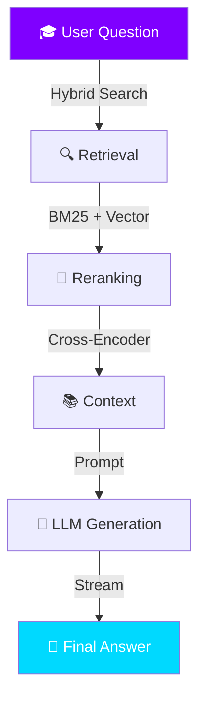
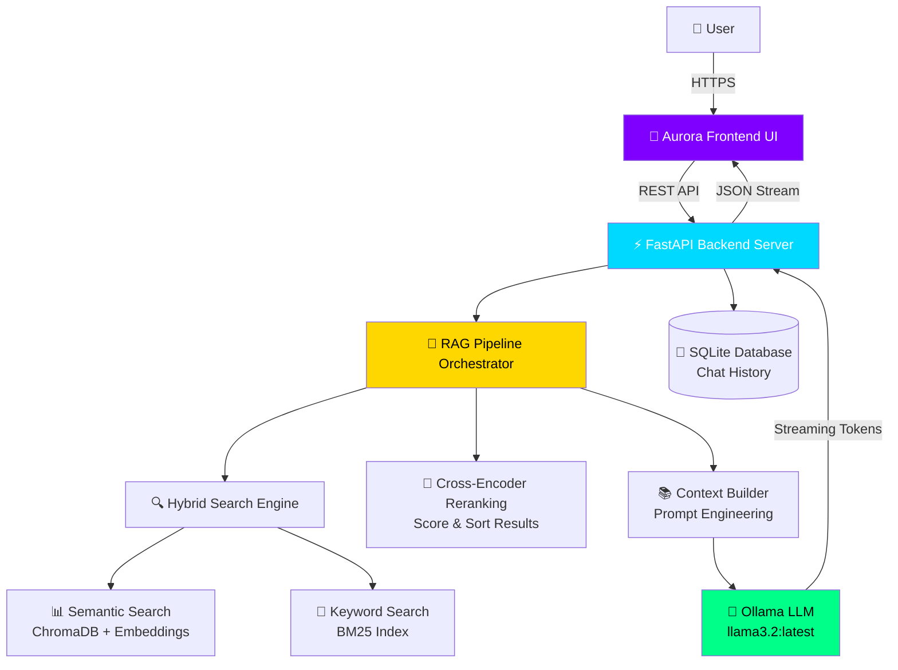

<div align="center">


<h3>
  
  
  
</h3>

[](https://python.org)
[](https://fastapi.tiangolo.com)
[](https://ollama.ai)
[](https://trychroma.com)
[](LICENSE)

<br/>

### 💎 **Experience the Future of Learning**

*Transform your video library into an interactive, intelligent knowledge base with our stunning Glassmorphism Aurora interface.*

<br/>

**[🚀 Quick Start](#-quick-start-guide) • [✨ Features](#-core-features) • [⚙️ Architecture](#️-system-architecture) • [📂 Structure](#-project-structure) • [🤝 Contributing](#-contributing)**

<br/>

</div>

---

<div align="center">

## 🎨 **Live Interface Preview**

### 🌟 Main Dashboard - Aurora Welcome Screen

<div align="center">

</div>

*Beautiful gradient-based UI with glassmorphism effects and pre-built example prompts*

<br/>

### 💬 Interactive Chat Interface

<div align="center">

</div>

*Real-time streaming responses with context-aware answers and video timestamps*

</div>

---

<div align="center">

## 🌟 **What is MindMesh AI (Aurora RAG)?**

<br/>


</div>

<br/>

<table>
<tr>
<td width="100%" align="center">

### **MindMesh AI** transforms your video course library into an **intelligent, AI-powered knowledge base**

*Production-ready conversational assistant with stunning Glassmorphism UI*

</td>
</tr>
</table>

<br/>

<table>
<tr>
<td width="33%" align="center">

### 🏗️ **Built With**

**FastAPI** Backend
<br/>⚡ High-performance async

**Vanilla JS/CSS** Frontend
<br/>🎨 Zero dependencies

**Ollama** AI Models
<br/>🤖 Local & private

</td>
<td width="34%" align="center">

### 🎯 **Core Technology**

**Hybrid RAG Pipeline**
<br/>🔍 BM25 + Embeddings

**Cross-Encoder Reranking**
<br/>🎯 Precision results

**Streaming Responses**
<br/>⚡ Real-time feedback

</td>
<td width="33%" align="center">

### 💎 **Design Philosophy**

**Glassmorphism UI**
<br/>✨ Premium aesthetics

**Aurora Theme**
<br/>🌌 Purple-cyan gradients

**Mobile-First**
<br/>📱 Fully responsive

</td>
</tr>
</table>

<br/>

---

<div align="center">

### 🎭 **Why Choose MindMesh AI?**

<br/>

<blockquote align="left">
<h4>💡 "It's not just about finding answers; it's about the experience."</h4>
</blockquote>

</div>

<br/>

<table>
<tr>
<td width="50%" valign="top">

### 🧠 **Context-Aware Intelligence**

Remembers your entire conversation history for coherent, multi-turn dialogues. Ask follow-up questions naturally without repeating context.

> ✅ **Multi-turn conversations**<br/>
> ✅ **Context retention**<br/>
> ✅ **Smart reference resolution**<br/>
> ✅ **Conversation branching**

---

### ⚡ **Real-Time Streaming**

ChatGPT-style token-by-token streaming for instant feedback. See responses as they're generated, not after completion.

> ⚡ **Token streaming**<br/>
> ⚡ **Progress indicators**<br/>
> ⚡ **Stop generation control**<br/>
> ⚡ **Sub-second first token**

---

### 🎯 **Precision Retrieval**

Hybrid search combining BM25 keyword matching with semantic embeddings, followed by cross-encoder reranking for maximum accuracy.

> 🔍 **Hybrid search (BM25 + Vector)**<br/>
> 🎯 **Cross-encoder reranking**<br/>
> 📊 **Relevance scoring**<br/>
> 📑 **Source attribution**

</td>
<td width="50%" valign="top">

<br/>

<div align="center">

### 📊 **How Aurora Works**



</div>

<br/>

---

### 🎬 **Smart Deep Linking**

Jump directly to exact timestamps in source videos. Every answer includes clickable timestamps that take you to the relevant moment.

> ⏱️ **Precise timestamp extraction**<br/>
> 🔗 **Clickable video links**<br/>
> 📽️ **Multiple source references**<br/>
> 💯 **Confidence scoring**

---

### 🎨 **Premium UI/UX**

Beautiful Aurora theme with purple-cyan gradients, glassmorphism effects, smooth animations, and dark mode optimization.

> ✨ **Glassmorphism design**<br/>
> 🌊 **Smooth transitions**<br/>
> ⌨️ **Typing animations**<br/>
> 📋 **Copy to clipboard**

</td>
</tr>
</table>

<br/>

<div align="center">

### ⚡ **Performance Highlights**

<table>
<tr>
<td align="center" width="25%">
<h3>~200ms</h3>
<sub>Hybrid Search</sub>
</td>
<td align="center" width="25%">
<h3>~150ms</h3>
<sub>Reranking</sub>
</td>
<td align="center" width="25%">
<h3>~500ms</h3>
<sub>First Token</sub>
</td>
<td align="center" width="25%">
<h3>100%</h3>
<sub>Local & Private</sub>
</td>
</tr>
</table>

</div>

---

<div align="center">

## ✨ **Core Features**

<br/>

*Everything you need for a premium RAG experience, out of the box*

</div>

<br/>

### 🤖 **Intelligent Backend Architecture**

<table>
<tr>
<td width="25%" valign="top">

#### 🏗️ **FastAPI Core**

**High-Performance Server**

• `async/await` for high concurrency
• Type-safe with Pydantic models
• Auto-generated OpenAPI docs
• CORS-enabled REST API
• Health check endpoints

<br/>

<div align="center">

</div>

</td>
<td width="25%" valign="top">

#### 🧠 **RAG Pipeline**

**Advanced Retrieval System**

• Multi-stage retrieval pipeline
• Context-aware generation
• Smart chunk selection
• Prompt engineering
• Source attribution

<br/>

<div align="center">

</div>

</td>
<td width="25%" valign="top">

#### 📡 **Streaming**

**Real-Time Responses**

• Token-by-token streaming
• Newline-delimited JSON
• Graceful error handling
• Stop generation control
• Progress feedback

<br/>

<div align="center">

</div>

</td>
<td width="25%" valign="top">

#### 💾 **Sessions**

**Persistent History**

• SQLite-based storage
• Multi-session support
• Conversation history
• Context retention
• Export capabilities

<br/>

<div align="center">

</div>

</td>
</tr>
</table>

<br/>

### 🛠️ **Technology Stack**

<div align="center">

<table>
<tr>
<td align="center" width="20%">
<br/>
<sub><b>Frontend</b></sub>
</td>
<td align="center" width="20%">
<br/>
<sub><b>Backend</b></sub>
</td>
<td align="center" width="20%">
<br/>
<sub><b>LLM Engine</b></sub>
</td>
<td align="center" width="20%">
<br/>
<sub><b>Vector DB</b></sub>
</td>
<td align="center" width="20%">
<br/>
<sub><b>Database</b></sub>
</td>
</tr>
</table>

**Models:** `llama3.2:latest` • `bge-m3:latest` • `nomic-embed-text` • `gemma3:4b`

</div>

---

<div align="center">

## ⚙️ **System Architecture**

</div>

The MindMesh AI architecture is built for **speed, accuracy, and scalability**. It separates concerns cleanly between the client interface, API gateway, and AI processing engine.



<br/>

<div align="center">

### 🔄 **How It Works**

</div>

The RAG (Retrieval-Augmented Generation) pipeline executes in 6 distinct steps:

<table>
<tr>
<td align="center" width="16.66%">

**1️⃣ User Query**
<br/>🎤
<br/>
<sub>The user submits a question via the chat interface.</sub>

</td>
<td align="center" width="16.66%">

**2️⃣ Search**
<br/>🔍
<br/>
<sub>The backend performs a Hybrid Search using BM25 & Vector similarity.</sub>

</td>
<td align="center" width="16.66%">

**3️⃣ Rerank**
<br/>🎯
<br/>
<sub>A cross-encoder scores and reranks the top candidates.</sub>

</td>
<td align="center" width="16.66%">

**4️⃣ Context**
<br/>📚
<br/>
<sub>The most relevant video chunks are injected into the RAG prompt.</sub>

</td>
<td align="center" width="16.66%">

**5️⃣ Generate**
<br/>🤖
<br/>
<sub>The Ollama LLM generates an answer based on the injected context.</sub>

</td>
<td align="center" width="16.66%">

**6️⃣ Stream**
<br/>💬
<br/>
<sub>The response is streamed token-by-token back to the user.</sub>

</td>
</tr>
</table>

---

<div align="center">

## 📂 **Project Structure**

</div>

The repository is organized to separate the data ingestion pipeline, the active application logic, and the persistent data stores.

```plaintext
RAG-Based-AI/
│
├── 📁 project/
│   │
│   ├── 📁 backend/                    # ⚡ FastAPI Backend Application
│   │   ├── main.py                    # 🚀 API entry point & endpoints
│   │   ├── rag_pipeline.py            # 🧠 Core RAG orchestration logic
│   │   ├── search.py                  # 🔍 Hybrid search engine
│   │   ├── models.py                  # 📋 Pydantic request/response models
│   │   ├── config.py                  # ⚙️  Configuration management
│   │   ├── prompts.py                 # 💬 Prompt templates
│   │   ├── utils.py                   # 🛠️  Helper utilities
│   │   ├── database.py                # 💾 SQLite operations
│   │   ├── requirements.txt           # 📦 Python dependencies
│   │   ├── embeddings.joblib          # 📊 Pre-computed embeddings (7MB)
│   │   ├── bm25_index.joblib          # 📝 BM25 search index (8MB)
│   │   └── chat_history.db            # 💬 Chat session database
│   │
│   └── 📁 frontend/                   # 🎨 Aurora UI (Vanilla JS)
│       ├── index.html                 # 🌐 Single Page Application
│       ├── style.css                  # 💎 Glassmorphism styling
│       ├── script.js                  # ⚡ Chat logic & API calls
│       └── 📁 assets/                 # 🖼️  Images & resources
│
├── 📁 legacy/                         # 📦 Legacy/Archived Scripts
│   ├── app.py                         # Old Streamlit prototype
│   ├── video_to_mp3.py                # Video ingestion pipeline
│   ├── preprocess_json.py             # Data preprocessing
│   └── ...
│
├── 📁 jsons/                          # 📄 Transcription JSON files
│   ├── 01_Installing VS Code.json
│   ├── 02_Your First HTML.json
│   └── ... (18 course transcripts)
│
├── README.md                          # 📖 This file
├── .env                               # 🔐 Environment variables
├── start_aurora.bat                   # 🪟 Windows startup script
└── start_aurora.sh                    # 🐧 Linux/Mac startup script
```

---

<div align="center">

## 🚀 **Quick Start Guide**

Get MindMesh AI running in **under 5 minutes!**

</div>

<br/>

### 📋 **Prerequisites**

```bash
✅ Python 3.10 or higher
✅ Ollama installed with models: llama3.2, bge-m3
✅ Modern web browser (Chrome, Firefox, Edge)
```

<br/>

### ⚡ **Installation Steps**

<table>
<tr>
<td width="10%" align="center">

### 1️⃣

</td>
<td width="90%">

**Clone the Repository**

```bash
git clone https://github.com/Piyu242005/MindMesh-AI.git
cd RAG-Based-AI
```

</td>
</tr>
<tr>
<td align="center">

### 2️⃣

</td>
<td>

**Install Dependencies**

```bash
cd project/backend
pip install -r requirements.txt
```

</td>
</tr>
<tr>
<td align="center">

### 3️⃣

</td>
<td>

**Start the Backend Server**

```bash
# From project/backend directory
uvicorn main:app --port 8000 --host 0.0.0.0
```

✨ **API Documentation:** `http://localhost:8000/docs`

</td>
</tr>
<tr>
<td align="center">

### 4️⃣

</td>
<td>

**Launch the Frontend**

Simply open `project/frontend/index.html` in your browser!

```bash
# Or serve it locally
cd project/frontend
python -m http.server 3000
```

🌐 **Open:** `http://localhost:3000`

</td>
</tr>
</table>

---

<div align="center">

## 🤝 **Contributing**

We welcome contributions from Open Source Developers, Data Scientists, and AI Enthusiasts! 

</div>

### How to Contribute

1. **Fork the repository** to your own GitHub account.
2. **Create your feature branch:**
   ```bash
   git checkout -b feature/AmazingFeature
   ```
3. **Commit your changes:**
   ```bash
   git commit -m 'Add some AmazingFeature'
   ```
4. **Push to the branch:**
   ```bash
   git push origin feature/AmazingFeature
   ```
5. **Open a Pull Request** against the main repository.

<br/>

<div align="center">

**Read [CONTRIBUTING.md](Contributing.md) for detailed guidelines**

**Follow our [CODE_OF_CONDUCT.md](CODE_OF_CONDUCT.md)**

</div>

---

<div align="center">

## 📄 **License**

This project is licensed under the **MIT License** - see the LICENSE file for details.

<br/>

## 🙏 **Acknowledgments**

Built with amazing open-source tools:

**[FastAPI](https://fastapi.tiangolo.com/)** • **[Ollama](https://ollama.ai/)** • **[ChromaDB](https://trychroma.com/)** • **[Sentence-Transformers](https://www.sbert.net/)** • **[BM25](https://github.com/dorianbrown/rank_bm25)**

</div>

---

<div align="center">

<br/>

## 💜 **Built with passion by**

### **Piyush Ramteke**

<br/>

[](https://www.linkedin.com/in/piyu24)
[](https://github.com/Piyu242005)

<br/>


<br/>

---

### ⭐ **If you found this helpful, please consider giving it a star!**

<br/>

<sub>© 2026 MindMesh AI (Aurora RAG). All rights reserved.</sub>

</div>
