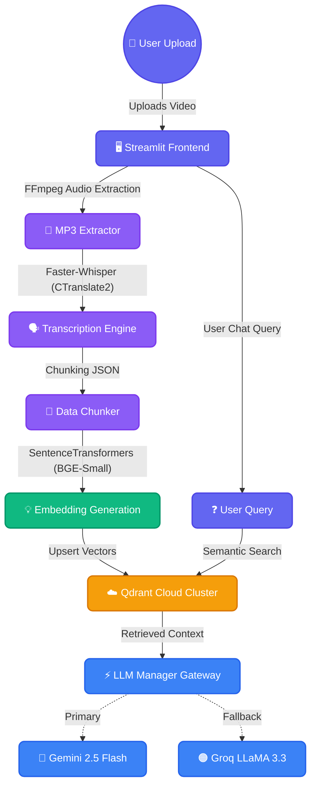

<div align="center">


# MindMesh AI

**Enterprise Video RAG & Autonomous Knowledge Base Platform**

[](https://git.io/typing-svg)

[](https://python.org)
[](https://streamlit.io)
[](https://qdrant.tech/)
[](https://ai.google.dev/)
[](https://groq.com)
[](https://huggingface.co/)
<br>
[](https://opensource.org/licenses/MIT)
[](https://github.com/Piyu242005/MindMesh-AI/stargazers)
[](https://github.com/Piyu242005/MindMesh-AI/network/members)

</div>

<br/>

## 📝 Overview

**MindMesh AI** is a production-grade enterprise application that transforms raw educational videos and courses into a deeply searchable, interactive AI knowledge base. It leverages Faster-Whisper for high-speed offline transcription, SentenceTransformers for chunk embedding, and Qdrant Cloud for blazing-fast vector retrieval. 

By orchestrating intelligent routing between Google Gemini Flash and Groq's LLaMA 3.3, MindMesh AI delivers scalable, context-aware answers directly linked to exact video timestamps.

---

## ✨ Key Features

| Feature | Description |
| :--- | :--- |
| ⚡ **Faster-Whisper Transcription** | Transcribes video courses at incredible speeds with GPU acceleration via CTranslate2. |
| 🔀 **Multi-LLM Gateway** | Unified interface combining models from Google Gemini and Groq with seamless failover. |
| 🛡️ **Automatic Fallback System** | Seamlessly reroutes failed API requests (e.g., 429 Quota limits) to backup providers. |
| 🌐 **Qdrant Cloud Integration** | High-performance semantic vector search completely removing local memory bottlenecks. |
| ⏱️ **Timestamp Deep Linking** | AI answers include precise timestamps tracing back to the exact moment in the source video. |
| 📊 **Advanced Analytics Dashboard** | Real-time telemetry tracking total requests, token counts, and LLM latency. |
| 🎨 **Premium UI/UX** | Dark-mode Streamlit interface with responsive sidebars, custom styling, and live transcription progress. |

---

## 🏗️ Architecture



---

## 💻 Tech Stack

<div align="center">

| Layer | Technologies |
| :--- | :--- |
| **Frontend** |  HTML5, CSS3 |
| **Backend** |  |
| **AI Models** |   |
| **Data & Vectors** |   |
| **Audio Processing**| `Faster-Whisper`, `FFmpeg` |

</div>

---

## 📂 Project Structure

```bash
MindMesh-AI/
├── backend/                 # ⚡ Core backend services
│   ├── embeddings.py        # SentenceTransformers encoding
│   ├── llm_manager.py       # Gemini/Groq Fallback Router
│   ├── retrieval.py         # Search & QA pipeline
│   └── transcription.py     # Faster-Whisper pipeline
├── pages/                   # 🖥️ Streamlit Views
│   ├── ai_chat.py           # Conversational Interface
│   ├── dashboard.py         # Analytics Dashboard
│   ├── settings.py          # LLM & Whisper Config
│   └── upload_center.py     # Video processing hub
├── app.py                   # Main Streamlit Entrypoint
├── qdrant_helper.py         # Qdrant Database driver
├── benchmark_transcription.py # Faster-Whisper benchmarking
├── validate_llm.py          # API Gateway Validation
├── requirements.txt         # Dependencies
└── .env.example             # Environment Variable Template
```

---

## ⚙️ Installation & Usage

### 1. Clone the Repository
```bash
git clone https://github.com/Piyu242005/MindMesh-AI.git
cd MindMesh-AI
```

### 2. Set up a Virtual Environment
```bash
python -m venv venv
source venv/bin/activate  # On Windows: venv\Scripts\activate
```

### 3. Install System Dependencies
Install [FFmpeg](https://ffmpeg.org/download.html) and ensure it is added to your system `PATH`.

### 4. Install Python Dependencies
```bash
pip install -r requirements.txt
```

### 5. Configure Environment Variables
Create a `.env` file in the root directory and add your API keys:
```env
# Google Gemini API
GEMINI_API_KEY=your_gemini_key

# Groq API
GROQ_API_KEY=your_groq_key

# Qdrant Cloud
QDRANT_URL=your_qdrant_cluster_url
QDRANT_API_KEY=your_qdrant_api_key

# Default Providers
LLM_PROVIDER=gemini
GEMINI_MODEL=gemini-2.5-flash
GROQ_MODEL=llama-3.3-70b-versatile
```

### 6. Run the Application
```bash
streamlit run app.py
```

---

## 🚀 How It Works

1. **Upload Video**: User uploads an `.mp4` or `.mkv` file via the Streamlit Upload Center.
2. **Audio Extraction & Transcription**: FFmpeg extracts the audio, and **Faster-Whisper** streams the transcription in real-time, yielding word-level segments and timestamps.
3. **Chunking & Vectorization**: Transcriptions are chunked into logical JSON blocks and vectorized using `sentence-transformers (bge-small-en-v1.5)`.
4. **Cloud Storage**: The vectors and metadata (timestamps, title) are upserted into **Qdrant Cloud**.
5. **Ask Question**: User submits a query via the AI Chat page.
6. **Smart Routing**: The `LLM Manager` directs the query along with Qdrant's semantic context to the primary cloud provider (Gemini). If rate limits are hit, it instantly fails-over to Groq.
7. **Delivery**: The user receives a contextual answer complete with exact source video timestamps.

---

## 👨‍💻 Author

### **Piyush Ramteke**
**Data Scientist | AI Engineer | Python Developer**

*Passionate about building scalable AI systems, Generative AI applications, and elegant data solutions.*

[](https://github.com/Piyu242005)
[](https://linkedin.com/in/piyush-ramteke)
[](https://huggingface.co/Piyu242005)
[](https://piyushramteke.dev)

---

<div align="center">
  <sub>Built with ❤️ using Python, Streamlit, and modern Generative AI.</sub>
</div>
