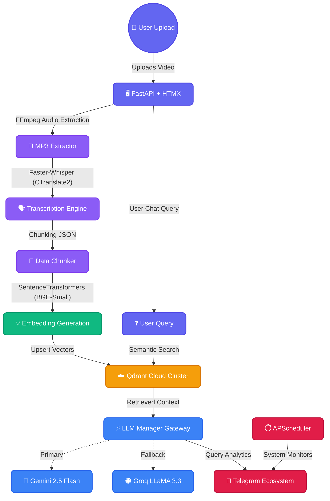

<div align="center">
  

  <h1>MindMesh AI</h1>

  <p>
    Transform Video Courses into Intelligent Knowledge Networks
  </p>
</div>

**Enterprise Video RAG & Autonomous Knowledge Base Platform**

[](https://git.io/typing-svg)

[](https://python.org)
[](https://fastapi.tiangolo.com)
[](https://qdrant.tech/)
[](https://kubernetes.io)
[](https://docker.com)
[](https://ai.google.dev/)
[](https://groq.com)
<br>
[](https://opensource.org/licenses/MIT)
[](https://github.com/Piyu242005/MindMesh-AI/stargazers)
[](https://github.com/Piyu242005/MindMesh-AI/network/members)

</div>

<br/>

## 📝 Overview

**MindMesh AI** is a production-grade enterprise application that transforms raw educational videos and courses into a deeply searchable, interactive AI knowledge base. Rebuilt from the ground up on **FastAPI**, **HTMX**, and **Tailwind CSS**, it brings bleeding-edge responsiveness while dropping frontend bloat.

By orchestrating intelligent routing between Google Gemini 2.5 Flash and Groq's LLaMA 3.3, coupled with **Qdrant Cloud** and **Faster-Whisper** offline transcription, MindMesh AI delivers highly scalable, context-aware answers directly linked to exact video timestamps. The system is hardened for production with **Docker**, **Kubernetes (K8s)** manifests, and a fully integrated **Telegram Ecosystem** for active system monitoring.

---

## 📸 Screenshots

*(Add screenshots of the Modern Dashboard, Chat Interface, and Onboarding Modal here)*

---

## 🌐 Live Demo

*(Insert Live URL Here once deployed)*

---

## ✨ Features

| Feature | Description |
| :--- | :--- |
| ⚡ **Faster-Whisper Transcription** | Transcribes video courses at incredible speeds with GPU acceleration via CTranslate2. |
| 🔀 **Multi-LLM Gateway** | Unified interface combining models from Google Gemini and Groq with seamless failover. |
| 🛡️ **Automatic Fallback System** | Seamlessly reroutes failed API requests (e.g., 429 Quota limits) to backup providers. |
| 📱 **Telegram Ecosystem** | Real-time alerts for server health, application errors, daily analytics, and CI/CD deployment status pushed directly to your phone. |
| 🌐 **Qdrant Cloud Integration** | High-performance semantic vector search completely removing local memory bottlenecks. |
| ⏱️ **Timestamp Deep Linking** | AI answers include precise timestamps tracing back to the exact moment in the source video. |
| 📊 **Advanced Analytics Dashboard** | Real-time telemetry tracking total requests, uploads, Qdrant vectors, and System Health. |
| 🎨 **Premium UI/UX** | Glassmorphism styling, dark-mode, first-time user onboarding modal, and snappy HTMX interactions. |

---

## 🏗️ Architecture Diagram



---

## 💻 Tech Stack

<div align="center">

| Layer | Technologies |
| :--- | :--- |
| **Frontend** |  `HTMX`, `Tailwind CSS`, `Jinja2` |
| **Backend Core** |  `APScheduler`, `python-telegram-bot` |
| **AI Models** |   |
| **Data & Vectors** |   |
| **DevOps & Infra**|   `GitHub Actions` |

</div>

---

## 🗺️ Roadmap

- [x] Streamlit to FastAPI + HTMX Migration
- [x] Containerize Application (Docker multi-stage build)
- [x] Integrate Kubernetes Manifests for Production K8s Deployment
- [x] Telegram Operations & Alerts Ecosystem
- [x] Implement First-time User Onboarding
- [ ] Add User Authentication (OAuth/JWT)
- [ ] Setup Persistent Database for user profiles
- [ ] YouTube Video URL Parsing & Downloading

---

## 🚀 Deployment

MindMesh AI is fully containerized and production-ready for Kubernetes. 

See the dedicated documentation for detailed deployment instructions:
- [Docker Deployment Guide](DEPLOYMENT.md)
- [Kubernetes Setup Guide](KUBERNETES.md)
- [Telegram Ecosystem Setup](TELEGRAM_SETUP.md)

### Quick Docker Run
```bash
docker build -t mindmesh-ai .
docker run -d -p 8000:8000 --env-file .env mindmesh-ai
```

---

## ⚙️ Local Installation & Usage

### 1. Clone the Repository
```bash
git clone https://github.com/Piyu242005/MindMesh-AI.git
cd MindMesh-AI
```

### 2. Set up a Virtual Environment
```bash
python -m venv venv
source venv/bin/activate  # On Windows: venv\Scripts\activate
```

### 3. Install System Dependencies
Install [FFmpeg](https://ffmpeg.org/download.html) and ensure it is added to your system `PATH`.

### 4. Install Python Dependencies
```bash
pip install -r requirements.txt
```

### 5. Configure Environment Variables
Create a `.env` file in the root directory (using `.env.example` as a template):
```env
# Google Gemini API
GEMINI_API_KEY=your_gemini_key

# Groq API
GROQ_API_KEY=your_groq_key

# Qdrant Cloud
QDRANT_URL=your_qdrant_cluster_url
QDRANT_API_KEY=your_qdrant_api_key

# Telegram Setup
TELEGRAM_BOT_TOKEN=your_bot_token
TELEGRAM_ADMIN_CHAT_ID=your_chat_id
```

### 6. Run the Application
```bash
python main.py
```
Access the application at `http://localhost:8000`.

---

## 👨‍💻 Author

### **Piyush Ramteke**
**Data Scientist | AI Engineer | Python Developer**

*Passionate about building scalable AI systems, Generative AI applications, and elegant data solutions.*

[](https://github.com/Piyu242005)
[](https://linkedin.com/in/piyush-ramteke)
[](https://huggingface.co/Piyu242005)
[](https://piyushramteke.dev)

---

<div align="center">
  <sub>Built with ❤️ using FastAPI, HTMX, and modern Generative AI.</sub>
</div>
