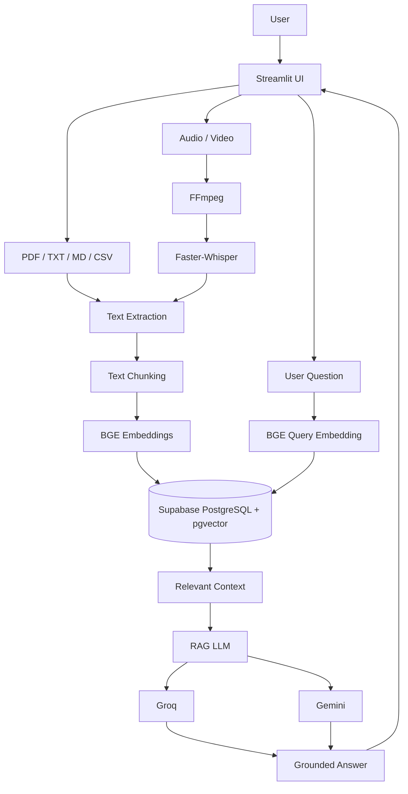
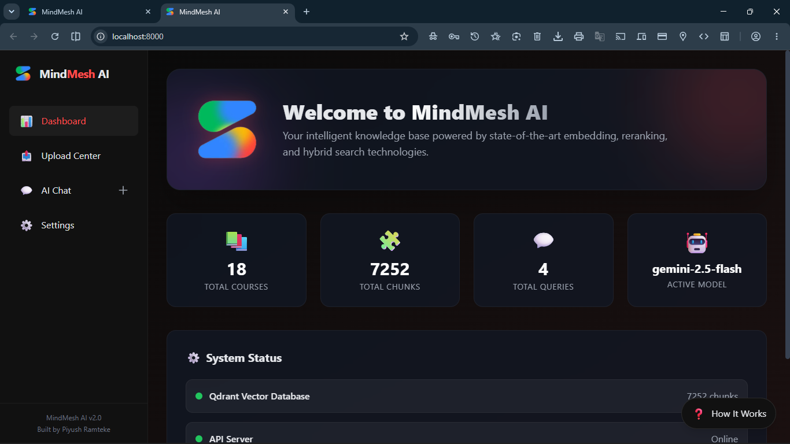

# 🧠 MindMesh AI

### AI Knowledge Base & RAG Learning Assistant

MindMesh AI transforms documents, educational videos, and audio into a searchable AI knowledge base. It combines **Faster-Whisper, semantic embeddings, Supabase PostgreSQL + pgvector, RAG, and Gemini/Groq** to answer questions from your own content.

> **Purpose:** Turn long courses and large collections of documents into an interactive knowledge system where users can ask questions instead of manually searching through hours of content.

## ✨ Core Features

| Feature | Purpose |
|---|---|
| 📄 Document Ingestion | Process PDF, TXT, Markdown and CSV files |
| 🎙️ Faster-Whisper | Converts audio/video into searchable transcripts |
| 🧩 Chunking + Embeddings | Converts content into retrieval-ready knowledge |
| 🗄️ Supabase + pgvector | Stores documents, chunks and vector embeddings |
| 🔎 Semantic Search | Retrieves the most relevant knowledge for each question |
| 🤖 RAG Chat | Generates grounded answers from indexed content |
| ⚡ Groq / Gemini | Flexible LLM generation |
| 📊 Analytics | Shows vector database, LLM and embedding health |
| 🖥️ Streamlit | Simple, user-friendly knowledge workspace |
| 🚀 FastAPI | Existing API/backend architecture remains available |

## 🏗️ Current Architecture

### Streamlit + Supabase


```mermaid
graph TD
    U[User] --> S[Streamlit UI]
    S --> D[PDF / TXT / MD / CSV]
    S --> M[Audio / Video]
    M --> F[FFmpeg]
    F --> W[Faster-Whisper]
    D --> C[Text Extraction]
    W --> C
    C --> CH[Text Chunking]
    CH --> E[BGE Embeddings]
    E --> SB[(Supabase PostgreSQL + pgvector)]
    S --> Q[User Question]
    Q --> QE[BGE Query Embedding]
    QE --> SB
    SB --> CTX[Relevant Context]
    CTX --> L[RAG LLM]
    L --> G[Groq]
    L --> GE[Gemini]
    G --> A[Grounded Answer]
    GE --> A
    A --> S
```

### Existing FastAPI Architecture

The original FastAPI application remains available and is not replaced by the Streamlit interface.

## 🔄 How It Works

1. Upload a document, audio file, or video.
2. Extract text or transcribe media with Faster-Whisper.
3. Split content into overlapping chunks.
4. Generate BGE embeddings.
5. Store documents, chunks and embeddings in Supabase PostgreSQL using pgvector.
6. Convert each user question into an embedding.
7. Retrieve the most relevant chunks using Supabase vector similarity search.
8. Send the retrieved context to Groq or Gemini.
9. Return a concise, grounded answer with source information.

## 🛠️ Technology Stack

**Streamlit · Python 3.11 · Supabase · PostgreSQL · pgvector · Faster-Whisper · SentenceTransformers · BGE Embeddings · Groq · Gemini · FastAPI · FFmpeg · Docker**

## 📁 Streamlit Application

```text
MindMesh-AI/
└── MindMesh-AI/
    └── streamlit_app/
        ├── app.py
        ├── requirements.txt
        ├── packages.txt
        └── .streamlit/
            └── secrets.toml.example
```

The Streamlit entry point is:

```text
MindMesh-AI/streamlit_app/app.py
```

## 🚀 Run Streamlit Locally

```bash
git clone https://github.com/Piyu242005/MindMesh-AI.git
cd MindMesh-AI
python -m venv .venv
```

Windows:

```bash
.venv\Scripts\activate
```

macOS/Linux:

```bash
source .venv/bin/activate
```

Install Streamlit dependencies:

```bash
pip install -r MindMesh-AI/streamlit_app/requirements.txt
```

Install **FFmpeg** and make sure it is available on your system `PATH`.

Start the application:

```bash
streamlit run MindMesh-AI/streamlit_app/app.py
```

## 🔐 Streamlit Secrets

Configure the following values in Streamlit Cloud Secrets or your local Streamlit secrets file:

```toml
SUPABASE_URL = "https://YOUR_PROJECT_REF.supabase.co"
SUPABASE_KEY = "YOUR_SUPABASE_PUBLISHABLE_KEY"

GROQ_API_KEY = "YOUR_GROQ_API_KEY"
GROQ_MODEL = "llama-3.3-70b-versatile"

# Optional Gemini fallback
GEMINI_API_KEY = "YOUR_GEMINI_API_KEY"
GEMINI_MODEL = "gemini-2.5-flash"

EMBEDDING_MODEL = "BAAI/bge-small-en-v1.5"
RAG_TOP_K = "5"
WHISPER_MODEL = "base"
```

**Never commit real API keys or production secrets to GitHub.**

## ☁️ Streamlit Community Cloud

1. Open Streamlit Community Cloud.
2. Select the `Piyu242005/MindMesh-AI` repository.
3. Select the `main` branch.
4. Set the main file to:

```text
MindMesh-AI/streamlit_app/app.py
```

5. Add the required secrets.
6. Deploy.

`packages.txt` installs FFmpeg for audio/video processing.

## 🗄️ Supabase Backend

MindMesh's Streamlit RAG uses a dedicated Supabase project with:

- PostgreSQL
- `vector` / pgvector extension
- `mindmesh_documents` table
- `mindmesh_chunks` table
- Document upsert RPC
- Chunk insertion RPC
- Vector similarity search RPC

Qdrant is **no longer used by the Streamlit application**.

## 🐳 Existing Deployment

The original Docker/FastAPI deployment architecture remains available. Configure application secrets and infrastructure according to your deployment environment.

## 📸 Screenshots




## 🗺️ Roadmap

- [x] FastAPI architecture
- [x] Streamlit knowledge workspace
- [x] Faster-Whisper transcription
- [x] PDF / TXT / Markdown / CSV ingestion
- [x] Supabase PostgreSQL + pgvector
- [x] Semantic vector retrieval
- [x] RAG chat
- [x] Groq / Gemini support
- [x] FFmpeg media processing
- [ ] User authentication
- [ ] Multi-user knowledge bases
- [ ] YouTube URL ingestion
- [ ] Advanced knowledge graph
- [ ] Retrieval/answer evaluation suite

## 📌 Status

**Active development.** The Streamlit version is ready for deployment with Supabase + pgvector. The original FastAPI architecture remains available alongside the new Streamlit experience.

## 👨‍💻 Author

**Piyush Ramteke** — Data Scientist | AI Engineer | Python Developer

GitHub: https://github.com/Piyu242005
