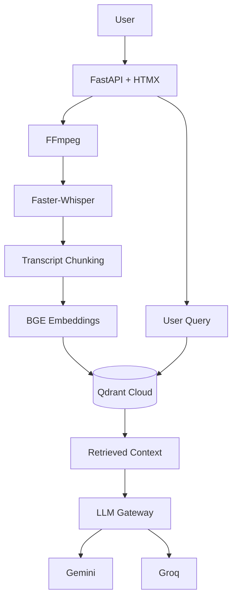

# 🧠 MindMesh AI

### Enterprise Video RAG & AI Knowledge Base

MindMesh AI transforms educational videos and courses into a searchable knowledge base. It combines **Faster-Whisper transcription, semantic embeddings, Qdrant vector search, RAG and multi-LLM generation** to answer questions with source timestamps.

> **Purpose:** I created MindMesh AI to solve a practical learning problem: turning long video courses into an interactive knowledge system where users can ask questions instead of manually searching hours of video.

## ✨ Core Features

| Feature | Purpose |
|---|---|
| 🎙️ Faster-Whisper | Converts video/audio into searchable transcripts |
| 🧩 Chunking + Embeddings | Converts transcript content into retrieval-ready knowledge |
| 🔎 Qdrant | Performs semantic vector search |
| 🤖 Multi-LLM | Uses Gemini/Groq with provider fallback |
| ⏱️ Timestamp Answers | Links answers back to source-video locations |
| 📊 Analytics | Tracks application activity and system health |
| 📡 Telegram | Optional operational alerts and telemetry |
| 🐳 Docker/Kubernetes | Containerized deployment architecture |

## 🏗️ Architecture


```mermaid
graph TD
    U[User] --> UI[FastAPI + HTMX]
    UI --> F[FFmpeg]
    F --> W[Faster-Whisper]
    W --> C[Transcript Chunking]
    C --> E[BGE Embeddings]
    E --> Q[(Qdrant Cloud)]
    UI --> R[User Query]
    R --> Q
    Q --> CTX[Retrieved Context]
    CTX --> L[LLM Gateway]
    L --> G[Gemini]
    L --> GR[Groq]
```

## 🔄 How It Works

1. Upload a video/course.
2. Extract audio with FFmpeg.
3. Transcribe with Faster-Whisper.
4. Chunk the transcript and generate embeddings.
5. Store vectors in Qdrant.
6. Retrieve relevant chunks for each query.
7. Generate an answer using the configured LLM.
8. Return contextual information and timestamps.

## 🛠️ Stack

**Python 3.11 · FastAPI · HTMX · Tailwind CSS · Faster-Whisper · SentenceTransformers · Qdrant Cloud · Gemini · Groq · Docker · Kubernetes · GitHub Actions**

## 🚀 Run Locally

```bash
git clone https://github.com/Piyu242005/MindMesh-AI.git
cd MindMesh-AI
python -m venv .venv
# Windows: .venv\Scripts\activate
# macOS/Linux: source .venv/bin/activate
pip install -r requirements.txt
```

Install **FFmpeg** and make sure it is available on `PATH`.

Configure `.env` using `.env.example`:

```env
GEMINI_API_KEY=your_key
GROQ_API_KEY=your_key
QDRANT_URL=your_qdrant_url
QDRANT_API_KEY=your_qdrant_key
SESSION_SECRET=your_random_secret
```

Start:

```bash
python main.py
```

## 🐳 Deployment

Docker and Kubernetes deployment configurations are included. Before real production deployment, configure secrets, storage, authentication and the target cluster environment.

```bash
docker build -t mindmesh-ai .
docker run -p 8000:8000 --env-file .env mindmesh-ai
```

## 📸 Screenshots


## 🗺️ Roadmap

- [x] FastAPI + HTMX architecture
- [x] Faster-Whisper transcription
- [x] Qdrant semantic retrieval
- [x] Multi-LLM fallback
- [x] Docker/Kubernetes configuration
- [ ] OAuth/JWT authentication
- [ ] Persistent user database
- [ ] YouTube URL ingestion
- [ ] Retrieval/answer evaluation suite

## 📌 Status

**Active development.** Infrastructure is production-oriented, while authentication and persistent user management remain roadmap items.

## 👨‍💻 Author

**Piyush Ramteke** — Data Scientist | AI Engineer | Python Developer

GitHub: https://github.com/Piyu242005
