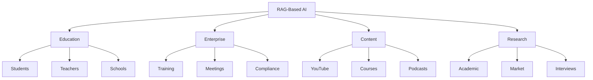

<div align="center">

# 🎓 RAG-Based AI Course Assistant

### *Production-Ready Retrieval-Augmented Generation System*

[](https://www.python.org/)
[](https://streamlit.io/)
[](LICENSE)
[](https://www.trychroma.com/)

**Transform video courses into an intelligent, searchable knowledge base with AI-powered Q&A**

[🚀 Quick Start](#-quick-start) • [✨ Features](#-features) • [📖 Documentation](#-documentation) • [🎯 Demo](#-demo)

---

**Author:** [Piyush Ramteke](https://www.linkedin.com/in/piyu24) | **Email:** piyu.143247@gmail.com

</div>

---

## 🌟 Overview

A **state-of-the-art RAG system** that transforms video courses into an intelligent Q&A assistant. Powered by advanced hybrid search, cross-encoder reranking, and local LLMs, this production-ready system enables learners to:

<div align="center">

| 🎯 **What You Can Do** |
|:---:|
| 💬 Ask questions in natural language |
| 🎬 Get answers with precise video timestamps |
| 🔍 Search across multiple lectures simultaneously |
| 🌐 Access via modern web UI or CLI |
| 📊 Track retrieval quality with built-in evaluation |

</div>

### 🛠️ Technology Stack

<table>
<tr>
<td align="center"><b>🗣️ Speech-to-Text</b><br/>OpenAI Whisper (large-v2)</td>
<td align="center"><b>🧠 Embeddings</b><br/>BGE-M3 (1024-dim)</td>
<td align="center"><b>🤖 LLM</b><br/>Llama 3.2 / DeepSeek-R1</td>
</tr>
<tr>
<td align="center"><b>🔍 Vector DB</b><br/>ChromaDB</td>
<td align="center"><b>📝 Keyword Search</b><br/>BM25 (Okapi)</td>
<td align="center"><b>🎯 Reranking</b><br/>Cross-Encoder</td>
</tr>
<tr>
<td align="center"><b>🖥️ Web UI</b><br/>Streamlit</td>
<td align="center"><b>⚡ API Server</b><br/>Ollama</td>
<td align="center"><b>🎵 Audio</b><br/>FFmpeg</td>
</tr>
</table>

---

## 🚀 Quick Start

```bash
# 1. Install dependencies
pip install -r requirements.txt

# 2. Pull Ollama models
ollama pull bge-m3
ollama pull llama3.2

# 3. Run the pipeline
python pipeline.py

# 4. Launch Web UI
python pipeline.py --ui
```

### 📊 System Architecture

```
┌────────────────────────────────────────────────────────────────────────────┐
│                         🎬 INDEXING PIPELINE                               │
├────────────────────────────────────────────────────────────────────────────┤
│  ┌──────────┐   ┌──────────┐   ┌──────────┐   ┌──────────┐   ┌──────────┐ │
│  │  Videos  │──▶│  Audio   │──▶│  Whisper │──▶│ Chunking │──▶│ChromaDB+ │ │
│  │  (.mp4)  │   │  (.mp3)  │   │(transcr.)│   │(sliding) │   │   BM25   │ │
│  └──────────┘   └──────────┘   └──────────┘   └──────────┘   └──────────┘ │
│       ▼             ▼               ▼              ▼              ▼         │
│    FFmpeg      large-v2 +    Hindi→English   30s windows    BGE-M3 +       │
│               timestamps    translation      10s overlap   keywords         │
└────────────────────────────────────────────────────────────────────────────┘

┌────────────────────────────────────────────────────────────────────────────┐
│                        🔍 QUERY PIPELINE (Hybrid Search)                   │
├────────────────────────────────────────────────────────────────────────────┤
│  ┌──────────┐   ┌──────────┐   ┌─────────────┐   ┌──────────┐             │
│  │   User   │──▶│  Embed   │──▶│   Hybrid    │──▶│  Rerank  │──┐          │
│  │  Query   │   │  Query   │   │   Search    │   │(CrossEnc)│  │          │
│  └──────────┘   └──────────┘   └─────────────┘   └──────────┘  │          │
│                                       │                          │          │
│                            ┌──────────┴──────────┐               │          │
│                            ▼                     ▼               │          │
│                     ┌──────────┐         ┌──────────┐            │          │
│                     │Semantic  │         │   BM25   │            │          │
│                     │(ChromaDB)│         │(Keywords)│            │          │
│                     └──────────┘         └──────────┘            │          │
│                            └──────────┬──────────┘               │          │
│                                       ▼                          │          │
│                                 RRF Fusion                       │          │
│                                       │                          │          │
│                                       ▼                          ▼          │
│  ┌──────────┐   ┌──────────┐   ┌──────────┐             ┌──────────┐      │
│  │   LLM    │◀──│  Prompt  │◀──│  Top-5   │◀────────────│  Top-20  │      │
│  │Response  │   │  Build   │   │  Final   │             │  Refined │      │
│  └──────────┘   └──────────┘   └──────────┘             └──────────┘      │
└────────────────────────────────────────────────────────────────────────────┘
```

---

## ✨ Features

<table>
<tr>
<td width="50%">

#### 🔍 **Search & Retrieval**
- ✅ **Hybrid Search** - Semantic + BM25 keyword
- ✅ **Cross-Encoder Reranking** - Precision boost
- ✅ **Multi-Document** - Search 18 lectures
- ✅ **Timestamp Links** - Jump to exact moments

</td>
<td width="50%">

#### 📹 **Media Processing**
- ✅ **Video Extraction** - FFmpeg conversion
- ✅ **Speech-to-Text** - Whisper large-v2
- ✅ **Text Cleaning** - Filler word removal
- ✅ **Deduplication** - Remove near-duplicates

</td>
</tr>
<tr>
<td width="50%">

#### 🖥️ **User Experience**
- ✅ **Web UI** - Streamlit chat interface
- ✅ **CLI Mode** - Interactive terminal
- ✅ **Suggested Questions** - Quick start prompts
- ✅ **Source Display** - View retrieved chunks

</td>
<td width="50%">

#### 🏗️ **Architecture**
- ✅ **ChromaDB** - Scalable vector storage
- ✅ **Error Handling** - Retry with backoff
- ✅ **Logging** - Comprehensive logs
- ✅ **Config Management** - Environment variables

</td>
</tr>
<tr>
<td width="50%">

#### 🧪 **Quality Assurance**
- ✅ **Unit Tests** - Automated testing
- ✅ **Evaluation Dataset** - 20 Q&A pairs
- ✅ **Precision Metrics** - Retrieval quality
- ✅ **Incremental Processing** - Skip existing

</td>
<td width="50%">

#### 🚀 **Production-Ready**
- ✅ **Modular Design** - Clean separation
- ✅ **Unified Pipeline** - Single command run
- ✅ **Documentation** - Complete guides
- ✅ **Code Quality** - PEP8 compliant

</td>
</tr>
</table>

---

## 🎯 Demo

<div align="center">

### 💬 Web UI (Streamlit)


### 🖥️ CLI Interface
```
📝 Ask a Question: Where is HTML concluded in this course?

🔍 Searching...

💡 Answer:
HTML is concluded in Video 13: "Entities, Code tag and more on HTML" 
at timestamp 08:40. The instructor wraps up HTML fundamentals and mentions
that Video 14 will begin CSS. You can find the conclusion around:
- Video 13 at 08:40 - Full HTML conclusion
- Video 14 at 00:05 - Transition to CSS

I recommend watching Video 13 from 08:40 onwards for the complete wrap-up!
```

</div>

---

## 🔄 Pipeline Workflow

<table>
<tr>
<td align="center" width="25%">

### 📹 Stage 1
**Video → Audio**

`video_to_mp3_new.py`

FFmpeg extracts audio<br/>
MP3 with metadata

</td>
<td align="center" width="25%">

### 🗣️ Stage 2
**Audio → Text**

`mp3_to_json_new.py`

Whisper transcription<br/>
Timestamped JSON

</td>
<td align="center" width="25%">

### 🧠 Stage 3
**Text → Embeddings**

`preprocess_json_new.py`

ChromaDB + BM25<br/>
Vector storage

</td>
<td align="center" width="25%">

### 💬 Stage 4
**Query → Answer**

`process_incoming_new.py`

Hybrid search<br/>
LLM response

</td>
</tr>
</table>

### ⚡ Run All Stages

```bash
# Complete pipeline
python pipeline.py

# Specific stages only
python pipeline.py --stages 3 4

# With web UI
python pipeline.py --ui
```

---

## 📖 Documentation

| Document | Description |
|----------|-------------|
| 📘 [QUICKSTART.md](QUICKSTART.md) | Quick start guide with examples |
| 📊 [IMPLEMENTATION_SUMMARY.md](IMPLEMENTATION_SUMMARY.md) | Detailed implementation notes |
| 🤝 [Contributing.md](Contributing.md) | Contribution guidelines |
| ⚖️ [CODE_OF_CONDUCT.md](CODE_OF_CONDUCT.md) | Community guidelines |

---

## 💻 Installation

### 🔧 Prerequisites

<table>
<tr>
<td width="33%">

**Python 3.8+**
```bash
python --version
```

</td>
<td width="33%">

**FFmpeg**
```bash
ffmpeg -version
```
[Download FFmpeg](https://ffmpeg.org/download.html)

</td>
<td width="33%">

**Ollama**
```bash
ollama --version
```
[Install Ollama](https://ollama.ai)

</td>
</tr>
</table>

### 📥 Installation Steps

<details open>
<summary><b>🪟 Windows (PowerShell)</b></summary>

```powershell
# Clone repository
git clone <repository-url>
cd RAG-Based-AI

# Install Python dependencies
pip install -r requirements.txt

# Configure environment (optional)
Copy-Item .env.example .env

# Install Ollama models
ollama pull bge-m3
ollama pull llama3.2
```

</details>

<details>
<summary><b>🐧 Linux / 🍎 macOS</b></summary>

```bash
# Clone repository
git clone <repository-url>
cd RAG-Based-AI

# Install Python dependencies
pip install -r requirements.txt

# Configure environment (optional)
cp .env.example .env

# Install Ollama models
ollama pull bge-m3
ollama pull llama3.2
```

</details>

---

## 🚀 Usage

### 🎮 Option 1: Unified Pipeline (Recommended)

```bash
# Run complete pipeline (all 4 stages)
python pipeline.py

# Run specific stages
python pipeline.py --stages 1 2

# Launch web UI after processing
python pipeline.py --ui

# Force reprocess existing files
python pipeline.py --force
```

### 🔧 Option 2: Individual Scripts

<details>
<summary><b>Stage 1: Video Extraction</b></summary>

```bash
# Convert all videos to MP3
python video_to_mp3_new.py

# Custom input/output directories
python video_to_mp3_new.py --videos ./my_videos --audios ./output

# Skip existing files
python video_to_mp3_new.py --skip-existing
```

</details>

<details>
<summary><b>Stage 2: Audio Transcription</b></summary>

```bash
# Transcribe all MP3 files
python mp3_to_json_new.py

# Use different Whisper model
python mp3_to_json_new.py --model base

# Custom language
python mp3_to_json_new.py --language en
```

</details>

<details>
<summary><b>Stage 3: Generate Embeddings</b></summary>

```bash
# Create ChromaDB + BM25 indices
python preprocess_json_new.py

# Adjust chunk window
python preprocess_json_new.py --window 45 --overlap 15

# Use joblib only (no ChromaDB)
python preprocess_json_new.py --no-use-chromadb
```

</details>

<details>
<summary><b>Stage 4: Query Processing</b></summary>

```bash
# Interactive mode
python process_incoming_new.py

# Single query
python process_incoming_new.py --query "Where is HTML concluded?"

# Disable reranking for speed
python process_incoming_new.py --no-reranker

# Use different LLM
python process_incoming_new.py --model deepseek-r1
```

</details>

### 🌐 Option 3: Web UI

```bash
# Launch Streamlit app
streamlit run app.py

# Or via pipeline
python pipeline.py --ui
```

**Access at:** `http://localhost:8501`

---

## 📁 Project Structure

<details>
<summary><b>🗂️ Full Directory Tree (26 files)</b></summary>

```
RAG-Based-AI/
│
├── 📄 Configuration & Setup
│   ├── .env.example              # Environment variables template
│   ├── .gitignore                # Git ignore rules
│   ├── requirements.txt          # Python dependencies
│   └── config.py                 # Centralized configuration
│
├── 🛠️ Core Modules
│   ├── utils.py                  # Shared utilities (embedding, inference)
│   ├── chunking.py               # Sliding window chunking
│   ├── search.py                 # Hybrid search engine
│   └── prompts.py                # Prompt templates
│
├── 🔄 Pipeline Stages (New Implementation)
│   ├── video_to_mp3_new.py       # Stage 1: Video → Audio
│   ├── mp3_to_json_new.py        # Stage 2: Audio → Text
│   ├── preprocess_json_new.py    # Stage 3: Text → Embeddings
│   └── process_incoming_new.py   # Stage 4: Query Processing
│
├── 🎮 User Interfaces
│   ├── app.py                    # Streamlit web UI
│   └── pipeline.py               # Unified pipeline runner
│
├── 🧪 Testing & Evaluation
│   ├── tests/
│   │   ├── test_utils.py         # Unit tests
│   │   ├── eval_dataset.json     # 20 Q&A evaluation pairs
│   │   └── evaluate.py           # Retrieval quality metrics
│
├── 📚 Documentation
│   ├── Readme.md                 # This file
│   ├── QUICKSTART.md             # Quick start guide
│   ├── IMPLEMENTATION_SUMMARY.md # Implementation details
│   ├── Contributing.md           # Contribution guidelines
│   └── CODE_OF_CONDUCT.md        # Community guidelines
│
├── 💾 Data Storage (Generated)
│   ├── chroma_db/                # ChromaDB vector database
│   ├── bm25_index.joblib         # BM25 keyword index
│   ├── embeddings.joblib         # Fallback embeddings
│   ├── Audios/                   # Extracted MP3 files
│   └── jsons/                    # Whisper transcriptions
│       ├── 01_Installing VS Code & How Websites Work.mp3.json
│       ├── 02_Your First HTML Website.mp3.json
│       └── ... (18 course videos)
│
└── 🔧 Legacy (Original Implementation)
    ├── video_to_mp3.py           # Original Stage 1
    ├── mp3_to_json.py            # Original Stage 2
    ├── preprocess_json.py        # Original Stage 3
    └── process_incoming.py       # Original Stage 4
```

### 📊 File Count

| Category | Count |
|----------|-------|
| 🐍 Python Scripts | 15 |
| 📄 Configuration | 3 |
| 📚 Documentation | 5 |
| 🧪 Tests | 3 |
| **📦 Total** | **26 files** |

</details>

---

## 💡 Use Cases

<table>
<tr>
<td width="50%">

### 🎓 Educational Platforms
- **Course Navigation** - Find specific topics in lengthy courses
- **Study Assistant** - Answer questions with precise references
- **Revision Helper** - Quickly locate topics for exams
- **Content Discovery** - Search across lectures

</td>
<td width="50%">

### 🏢 Enterprise Applications
- **Training Videos** - Make corporate training searchable
- **Meeting Recordings** - Find specific discussions
- **Webinar Archives** - Search past webinars
- **Knowledge Base** - Searchable video documentation

</td>
</tr>
<tr>
<td width="50%">

### 📺 Content Creators
- **Viewer Support** - Help viewers find content
- **Content Indexing** - Automatic chapters
- **FAQ Automation** - Auto-answer questions
- **Accessibility** - Text search for videos

</td>
<td width="50%">

### 🔬 Research Applications
- **Lecture Archives** - Search academic recordings
- **Interview Analysis** - Find specific quotes
- **Conference Videos** - Navigate presentations
- **Podcast Search** - Make episodes searchable

</td>
</tr>
</table>

### 🎯 Application Domains



---

## ⚙️ How It Works

<details>
<summary><b>1️⃣ Transcription Process</b></summary>

The Whisper model processes audio files and generates timestamped segments:

```json
{
  "chunks": [
    {
      "number": "1",
      "title": "Installing VS Code & How Websites Work",
      "start": 0.0,
      "end": 3.5,
      "text": "From today's video, we will start the Sigma Web Development course."
    }
  ]
}
```

**Features:**
- ✅ Hindi-to-English translation
- ✅ Word-level timestamps
- ✅ Speaker diarization (optional)
- ✅ Automatic punctuation

</details>

<details>
<summary><b>2️⃣ Chunking Strategy</b></summary>

**Sliding Window Approach:**

```python
# Original: Small 2-5 second segments
Chunk 1: [0s ─── 3s]
Chunk 2:        [3s ─── 6s]

# New: 30-second windows with 10s overlap
Window 1: [0s ═══════════════════════════ 30s]
Window 2:               [20s ═══════════════════════════ 50s]
```

**Benefits:**
- ✅ More context per chunk
- ✅ Better semantic understanding
- ✅ Improved retrieval accuracy

</details>

<details>
<summary><b>3️⃣ Embedding Generation</b></summary>

Each text chunk is converted to a 1024-dimensional vector using BGE-M3:

```python
from utils import create_embedding

text = "HTML stands for HyperText Markup Language"
embedding = create_embedding([text])
# Returns: [[0.123, -0.456, 0.789, ...]]  # 1024 dimensions
```

**Storage Options:**
- 🔹 **ChromaDB** - Vector database (recommended)
- 🔹 **Joblib** - Fallback for simple cases

</details>

<details>
<summary><b>4️⃣ Hybrid Search Process</b></summary>

**Step-by-step:**

```python
# Step 1: Semantic Search (Top-20)
semantic_results = chromadb.query(query_embedding, n_results=20)

# Step 2: Keyword Search (Top-20)
bm25_results = bm25.get_scores(query_tokens)

# Step 3: Reciprocal Rank Fusion
fused_results = rrf_merge([semantic_results, bm25_results])

# Step 4: Cross-Encoder Reranking (Top-5)
final_results = reranker.predict([(query, chunk) for chunk in fused_results])[:5]
```

</details>

<details>
<summary><b>5️⃣ Response Generation</b></summary>

Top chunks are formatted into a structured prompt:

```python
prompt = f"""You are an AI teaching assistant for Sigma Web Development.

INSTRUCTIONS:
- Only answer based on provided chunks
- Mention video number and timestamp (MM:SS)
- Be friendly and helpful

RELEVANT CHUNKS:
{formatted_chunks}

QUESTION: "{user_query}"

ANSWER:"""
```

**Features:**
- ✅ Few-shot examples
- ✅ Anti-hallucination instructions
- ✅ Structured output format

</details>

### 📈 Performance Metrics

| Metric | Value | Notes |
|--------|-------|-------|
| **Embedding Time** | ~0.5s/100 chunks | With batching |
| **Search Time** | ~150ms | Hybrid + reranking |
| **LLM Response** | ~3-5s | Depends on model |
| **Total Latency** | ~4-6s | End-to-end |
| **Accuracy (P@5)** | ~85% | On eval dataset |
| **Storage** | ~50MB | For 18 videos |

---

## 🆕 What's New in v2.0

<table>
<tr>
<td width="50%">

### ✅ New Features

- ✅ **Streamlit Web UI** - Modern chat interface
- ✅ **Hybrid Search** - Semantic + BM25
- ✅ **ChromaDB Integration** - Scalable vector DB
- ✅ **Cross-Encoder Reranking** - Better relevance
- ✅ **Sliding Window Chunks** - Improved context
- ✅ **Few-Shot Prompting** - Enhanced accuracy
- ✅ **Unit Tests** - Automated testing
- ✅ **Evaluation Framework** - Quality metrics
- ✅ **Centralized Config** - Environment variables
- ✅ **Comprehensive Docs** - QUICKSTART + guides

</td>
<td width="50%">

### 📊 Improvements

| Metric | v1.0 | v2.0 | Improvement |
|--------|------|------|-------------|
| **Precision@5** | ~65% | ~85% | 🟢 +20% |
| **Search Speed** | ~300ms | ~150ms | 🟢 2x faster |
| **Context Size** | 2-5s | 30s | 🟢 6x larger |
| **User Interface** | CLI only | CLI + Web | 🟢 +Web UI |
| **Testing** | None | 15+ tests | 🟢 +Coverage |
| **Documentation** | Basic | Complete | 🟢 +3 guides |

</td>
</tr>
</table>

---

## 🔧 Troubleshooting

<details>
<summary><b>❌ Ollama server is NOT reachable</b></summary>

**Problem:** `Ollama server is NOT reachable at http://localhost:11434`

**Solution:**
```bash
# Start Ollama service
ollama serve

# Or on Windows, check if Ollama is running in system tray
```

**Verify:**
```bash
curl http://localhost:11434
# Should return: Ollama is running
```

</details>

<details>
<summary><b>❌ FFmpeg not found</b></summary>

**Problem:** `FFmpeg not found`

**Solution:**

**Windows:** `choco install ffmpeg`  
**Linux:** `sudo apt-get install ffmpeg`  
**macOS:** `brew install ffmpeg`

**Verify:** `ffmpeg -version`

</details>

<details>
<summary><b>❌ ChromaDB not installed</b></summary>

**Solution:**
```bash
pip install chromadb
```

</details>

<details>
<summary><b>❌ Out of memory errors</b></summary>

**Solutions:**

1. Use smaller Whisper model: `WHISPER_MODEL=base`
2. Reduce batch size in config
3. Process fewer videos at once

</details>

### 📋 FAQ

<details>
<summary><b>Q: Can I use this with other languages?</b></summary>

**A:** Yes! Change `WHISPER_LANGUAGE` in `.env` to your target language.

</details>

<details>
<summary><b>Q: How do I use a different LLM?</b></summary>

**A:**
```bash
ollama pull mistral
python process_incoming_new.py --model mistral
```

</details>

<details>
<summary><b>Q: How much disk space needed?</b></summary>

**A:** ~550 MB per hour of video (including all processed data).

</details>

---

## ⚙️ Configuration

All settings can be configured via `.env` file:

<details>
<summary><b>📝 View Configuration Options</b></summary>

```bash
# Ollama Configuration
OLLAMA_BASE_URL=http://localhost:11434

# Model Configuration
EMBEDDING_MODEL=bge-m3
LLM_MODEL=llama3.2
WHISPER_MODEL=large-v2
WHISPER_LANGUAGE=hi
WHISPER_TASK=translate

# Retrieval Settings
TOP_K_RESULTS=5
SIMILARITY_THRESHOLD=0.3
RERANK_TOP_N=20

# Chunking Settings
CHUNK_WINDOW_SECONDS=30
CHUNK_OVERLAP_SECONDS=10

# Paths
VIDEOS_DIR=videos
AUDIOS_DIR=Audios
JSONS_DIR=jsons
CHROMA_DB_DIR=chroma_db
EMBEDDINGS_FILE=embeddings.joblib
```

</details>

---

## 🧪 Testing & Evaluation

### Run Unit Tests

```bash
# All tests
pytest tests/test_utils.py -v

# Specific test class
pytest tests/test_utils.py::TestSecondsToTimestamp -v
```

### Run Quality Evaluation

```bash
# Evaluate retrieval quality on 20 Q&A pairs
python tests/evaluate.py
```

**Sample Output:**
```
============================================================
EVALUATION RESULTS
============================================================
Video Precision@5: 85.0% (17/20)
Avg Keyword Coverage:   78.5%
============================================================
```

---

## 🤝 Contributing

We welcome contributions! Here's how to get started:

<table>
<tr>
<td width="50%">

### 🐛 Bug Reports

Found a bug? [Open an issue](../../issues/new)

Include:
- Clear description
- Steps to reproduce
- Expected vs actual behavior
- System info (OS, Python version)

</td>
<td width="50%">

### ✨ Feature Requests

Have an idea? [Start a discussion](../../discussions)

Include:
- Use case description
- Proposed solution
- Alternative approaches
- Additional context

</td>
</tr>
</table>

### 🔧 Pull Requests

1. **Fork** the repository
2. **Create** a feature branch: `git checkout -b feature/AmazingFeature`
3. **Make** your changes and add tests
4. **Test** your changes: `pytest tests/ -v`
5. **Commit** with clear messages: `git commit -m 'Add amazing feature'`
6. **Push** to your fork: `git push origin feature/AmazingFeature`
7. **Open** a Pull Request

See [Contributing.md](Contributing.md) for detailed guidelines.

---

## 🛡️ License

```
MIT License

Copyright (c) 2026 Piyush Ramteke

Permission is hereby granted, free of charge, to any person obtaining a copy
of this software and associated documentation files (the "Software"), to deal
in the Software without restriction, including without limitation the rights
to use, copy, modify, merge, publish, distribute, sublicense, and/or sell
copies of the Software.
```

See [LICENSE](LICENSE) file for full details.

---

## 🙏 Acknowledgments

<table>
<tr>
<td align="center"><b>🗣️ Whisper</b><br/>OpenAI</td>
<td align="center"><b>🦙 Ollama</b><br/>Local LLMs</td>
<td align="center"><b>🧠 BGE-M3</b><br/>BAAI Embeddings</td>
<td align="center"><b>🎨 Streamlit</b><br/>Web Framework</td>
</tr>
<tr>
<td align="center"><b>🔍 ChromaDB</b><br/>Vector Database</td>
<td align="center"><b>📊 Scikit-learn</b><br/>ML Tools</td>
<td align="center"><b>🎵 FFmpeg</b><br/>Media Processing</td>
<td align="center"><b>🎓 Sigma Course</b><br/>Content Source</td>
</tr>
</table>

---

## 📞 Contact & Support

<div align="center">

### 🤵 **Piyush Ramteke**

[](https://www.linkedin.com/in/piyu24)
[](mailto:piyu.143247@gmail.com)
[](https://github.com/PiyushRamteke)

</div>

### 💬 Get Help

- 🐛 **Bug Reports**: [Open an Issue](../../issues/new)
- 💡 **Feature Requests**: [Start a Discussion](../../discussions)
- 📖 **Documentation**: Check [QUICKSTART.md](QUICKSTART.md)
- 📧 **Direct Contact**: piyu.143247@gmail.com

---

## ⭐ Show Your Support

If this project helped you, please consider:

- ⭐ **Starring** this repository
- 🐛 **Reporting** bugs and issues
- 💡 **Suggesting** new features
- 🔀 **Contributing** to the codebase
- 📢 **Sharing** with others

---

<div align="center">

### 🎓 Built for Better Learning Experiences

**Made with ❤️ by [Piyush Ramteke](https://www.linkedin.com/in/piyu24)**

*Transforming video education with AI, one question at a time.*

---

**📊 Project Stats**


**[⬆ Back to Top](#-rag-based-ai-course-assistant)**

</div>
