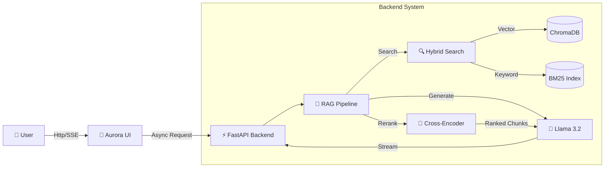

<div align="center">

# 🌌 Aurora RAG Assistant
### *Next-Gen AI Video Course Assistant*

[](https://python.org)
[](https://fastapi.tiangolo.com)
[](https://ollama.ai)
[](https://trychroma.com)

<br/>

**Experience the future of learning.**
<br/>
*Transform your video library into an interactive, intelligent knowledge base with a stunning "Aurora" interface.*

[🚀 Quick Start](#-quick-start) • [✨ Features](#-features) • [🎨 Aurora UI](#-aurora-ui) • [⚙️ Architecture](#-architecture)


</div>

---

## 🌟 Overview

**Aurora RAG** is a production-ready Web Application that replaces traditional search with an AI-powered conversational interface. Built on **FastAPI** and a modern **Vanilla JS/CSS** frontend, it delivers sub-second retrieval times and streaming responses in a premium **Glassmorphism** environment.

### 🎭 Why Aurora?

> "It's not just about finding answers; it's about the experience."

- **🧠 Context-Aware**: Remembers your conversation history.
- **⚡ Real-Time**: Streaming tokens just like ChatGPT.
- **🎯 Precision**: Hybrid Search (BM25 + Embeddings) + Cross-Encoder Reranking.
- **🎬 Deep Linking**: Jumps straight to the exact second in the video.

---

## ✨ Features

<table>
<tr>
<td width="50%">

### 🤖 Intelligent Backend
- **FastAPI Core**: Async, high-performance Python backend.
- **Advanced RAG**: multi-stage retrieval pipeline.
- **Streaming Response**: Server-Sent Events (SSE) for instant feedback.
- **Session Management**: Handle multiple chats seamlessly.

</td>
<td width="50%">

### 🎨 Premium Frontend
- **Aurora Theme**: Deep gradients and glowing accents.
- **Glassmorphism**: Translucent cards and sidebars.
- **Responsive**: Mobile-first design.
- **Interactive**: Typing animations, stop generation, and more.

</td>
</tr>
</table>

---

## 🚀 Quick Start

### Prerequisites
- **Python 3.8+**
- **Ollama** (running `llama3.2` and `bge-m3`)

### 1️⃣ Installation

```bash
# Clone the repository
git clone <repository-url>
cd RAG-Based-AI

# Install dependencies
cd project/backend
pip install -r requirements.txt
```

### 2️⃣ Run the Backend

```bash
# From the project root
uvicorn project.backend.main:app --reload --port 8000
```

> The API documentation is available at `http://localhost:8000/docs`

### 3️⃣ Launch the Frontend

Simply open `project/frontend/index.html` in your favorite modern browser.

---

## ⚙️ Architecture



---

## 📂 Project Structure

```
RAG-Based-AI/
├── project/
│   ├── backend/           # ⚡ FastAPI Application
│   │   ├── main.py        # Entry point
│   │   ├── rag_pipeline.py# Core RAG Logic
│   │   ├── models.py      # Pydantic Schemas
│   │   └── config.py      # Settings
│   │
│   └── frontend/          # 🎨 Aurora UI
│       ├── index.html     # Single Page App
│       ├── style.css      # Premium Styling
│       └── script.js      # App Logic
│
├── legacy/                # 📦 Archived Scripts
│   ├── app.py             # Old Streamlit App
│   ├── video_to_mp3.py    # Ingestion Scripts
│   └── ...
│
├── chroma_db/             # 🗄️ Vector Database
└── ...
```

---

## 🔮 Future Roadmap

- [ ] **Multi-Model Support**: Switch between DeepSeek, Mistral, and Llama from UI.
- [ ] **Voice Mode**: Speak to the assistant directly.
- [ ] **File Upload**: Drag & Drop PDF/Docs to index on the fly.
- [ ] **Docker Support**: One-click deployment.

---

<div align="center">

**Built with 💜 by Piyush Ramteke**

[](https://www.linkedin.com/in/piyu24)
[](https://github.com/Piyu242005)

</div>